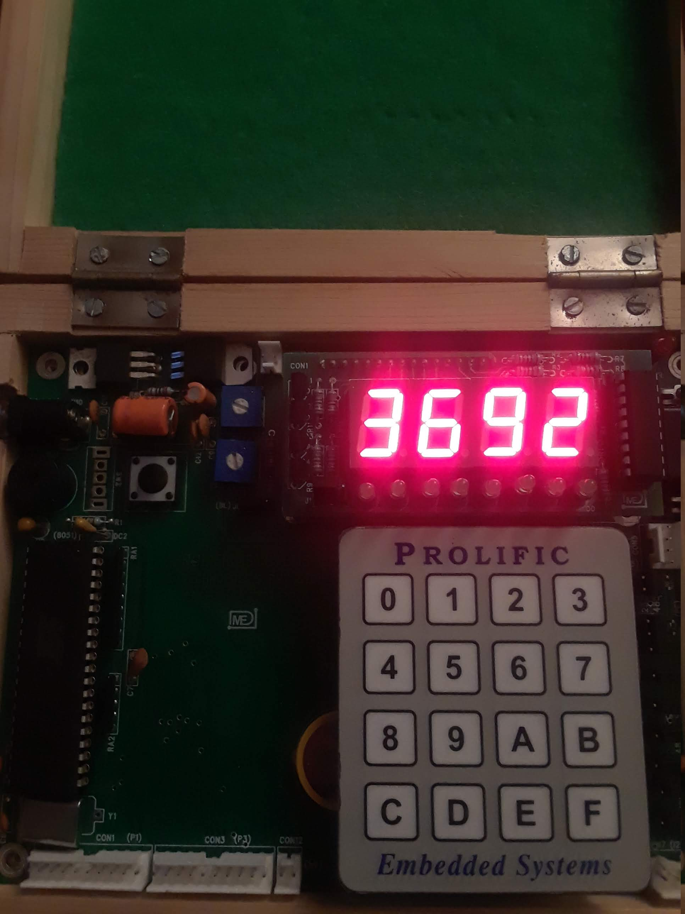

# 7seg_timer_interrupt
Interrupt based driver for 7-segment display

## Getting Started

### Requirements
* Keil IDE
* Flash Magic
* 8051 microcontroller
* Driver ULN 2803
* 7-segment displays (x4)

### Installing
1. Connect 7-segment displays to the 8051 microcontroller as shown in the following diagram:
   
1. Open Keil and create new project
   * Choose Philips P89V51RD2 database
1. Add 7seg_timer_interrupt.c file to Source Group
   * Edit numbersToDisplay variable on line 23 of 7seg_timer_interrupt.c: numbersToDisplay[4] = {N,N,N,N} 
1. Build target
1. Use Flash Magic to write the resulting hex file to the 8051 microcontroller

### Example

We can display the numbers 3, 6, 9, and 2 by saving them to the numbersToDisplay variable on line 23.
  After saving them to the variable, we build the target, and use Flash Magic to write the hex file to the microcontroller.

## Authors

* **Sahil Mahajan**

## License

This project intentionally has no license.
